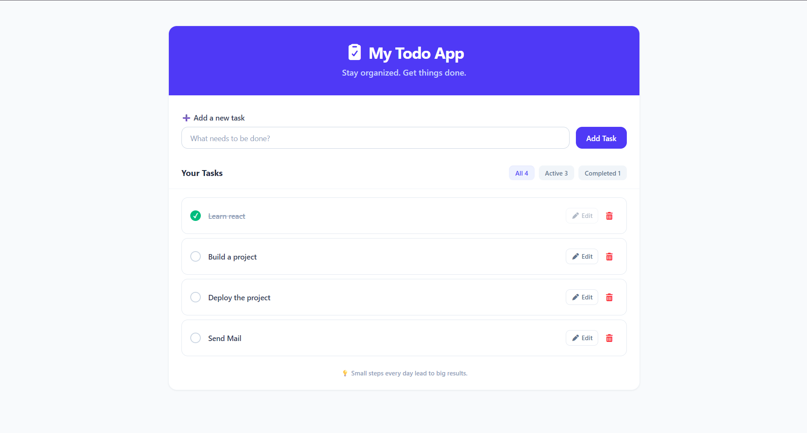
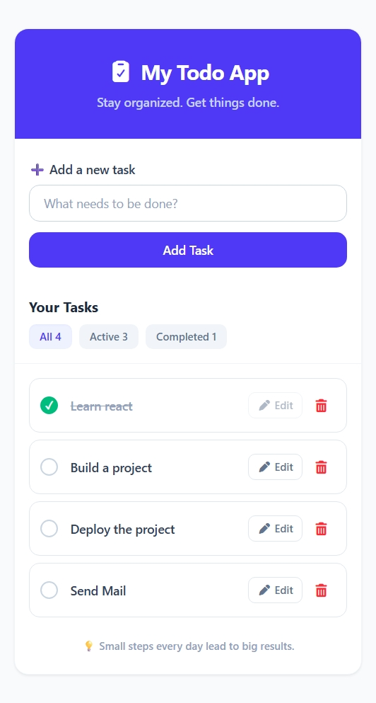

# Todo App

A responsive and user-friendly Todo application built with **React** and **Tailwind CSS**. The app allows users to create, edit, complete, delete, and filter tasks while keeping tasks saved in the browser using `localStorage`.

## 🚀 Live Demo

[View Live Demo](https://react-todo-list-coral-psi.vercel.app/)

## 📸 Screenshots

### Desktop View



### Mobile View



## ✨ Features

* Add new tasks
* Edit existing tasks
* Automatically focus the input when editing
* Mark tasks as completed or active
* Delete tasks
* Filter tasks by:

  * All
  * Active
  * Completed
* Display task counts for each filter
* Persistent data using `localStorage`
* Empty states for different task filters
* Responsive design for mobile, tablet, and desktop
* Keyboard support for saving edited tasks with `Enter`
* Accessible interactive buttons

## 🛠️ Tech Stack

* React
* JavaScript
* Tailwind CSS
* localStorage

### Icons
* Font Awesome

### Development Tools
* Vite
* Git
* GitHub
* VS Code

## 📂 Project Structure

```text
src/
├── components/
│   ├── Header.jsx
│   ├── TodoForm.jsx
│   ├── TodoItem.jsx
│   └── TodoList.jsx
│
├── App.jsx
├── index.css
└── main.jsx
```

## ⚙️ Getting Started

### 1. Clone the repository

```bash
git clone YOUR_GITHUB_REPOSITORY_URL
```

### 2. Navigate to the project

```bash
cd your-todo-app
```

### 3. Install dependencies

```bash
npm install
```

### 4. Start the development server

```bash
npm run dev
```

The application will be available at the local URL provided by Vite.

## 🧠 What I Learned

While building this project, I practiced:

* Managing state with React `useState`
* Using `useEffect` for side effects and `localStorage`
* Using `useRef` to automatically focus the edit input
* Passing data and functions between components using props
* Conditional rendering
* Filtering and updating arrays of objects
* Building reusable React components
* Creating responsive layouts with Tailwind CSS
* Using Tailwind's `peer` utility for custom checkbox interactions
* Creating accessible interactive elements

## 📱 Responsive Design

The application is designed to work across:

* 📱 Mobile devices
* 💻 Desktop screens
* 🖥️ Larger displays

## 📌 Future Improvements

Possible future enhancements include:

* Drag-and-drop task ordering
* Task priority levels
* Due dates
* Dark mode
* Search functionality

## 👨‍💻 Author

**Subhojit Dey**

Frontend Developer | React Developer

````
⭐ If you found this project useful, feel free to explore the repository.


